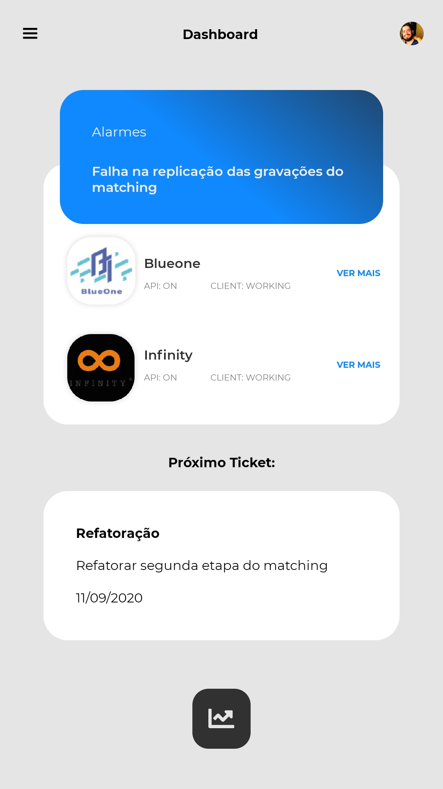

<h2 align="center">
  DDR - challenge - frontend_react-native
</h2>

## :iphone: About

Desenvolver a tela proposta [aqui](https://xd.adobe.com/view/94125693-cfc7-4bcf-842a-8de8144d5c19-c141/specs/).<br>
Você pode encontrar uma pequena demonstração em vídeo dentra do arquivo [zip](.github).

## Built with:

- Typescript (^3.8.3)
- react-native (0.63.0)
- Yarn (1.22.4)
- styled-components (^5.1.1)
- react-native-vector-icons (^7.0.0)
- react-native-linear-gradient (^2.5.6)
- Eslint (6.8.0)
- Preetier (^2.0.5)

## :framed_picture: :iphone: Mobile Screens

<h1 align="center">
  
</h1>

## Como instalar e rodar local :iphone:</strong>:

<strong>1. Clonar o projeto e instalar as dependências:</strong>

```
$ git clone https://github.com/jvictor-am/ddr-challenge-frontend.git
$ cd ddr-challenge-frontend
$ yarn install
```

<strong>2. Tenha um emulador disponível ou dispositivo físico conectado à máquina:</strong>

```
$ yarn android
```

<br>

---

[<p align="center">**João Victor**</p>](https://www.linkedin.com/in/jo%C3%A3o-victor-de-andrade-mesquita-848a09122/)

<h2 align="center">
  Thank You!
</h2>
